# Razor Pages with Entity Framework Core tips

-   [Beginner tips for ASP.NET Core/Razor Pages](#beginner-tips-for-asp.net-corerazor-pages)
    -   [Reqirements](#reqirements)
    -   [The project](#the-project)
    -   [The topics presented are](#the-topics-presented-are)
    -   [Microsoft
        Tutorial](#microsoft-tutorial)
-   [Creating the
    database](#creating-the-database)
-   [Reverse engineering the database](#reverse-engineering-the-database)
-   [Adding a new Razor
    Page](#adding-a-new-razor-page)
    -   [Update site
        navbar](#update-site-navbar)
    -   [Update ViewNotes
        Page](#update-viewnotes-page)
        -   [EF Core intitial
            load](#ef-core-intitial-load)
-   [Add the Detail
    Page](#add-the-detail-page)
-   [Add the Edit note
    Page](#add-the-edit-note-page)
-   [Add the create note
    page](#add-the-create-note-page)
-   [Formatting dates](#formatting-dates)
-   [Summary](#summary)

# Beginner tips for ASP.NET Core/Razor Pages

> **Note** Intent is not to teach step-by-step how to create a Razor
> Pages web application, instead the intent is to provide tips on moving
> past a basic Razor Pages project. Before beginning basic knowledge of
> C#, object oriented programming and entry level relational SQL skills.

## Reqirements

Microsoft Visual Studio 2022 any edition or higher

## The project

The project is a simple note application which has no bells and whistles
which is by design to keep topics easy to follow.

The user interface relies heavily on Bootstrap 5.1 with little in
regards to customized styles which all reside in site.css.

:bulb: Razor supports CSS Isolation where each Razor Page can have their
own styles, see the following
[repository](https://github.com/karenpayneoregon/razor-pages-style-isolation)
to learn how.

## The topics presented are

-   Using BootStrap v5.1.0 to spice up components on pages and how to
    provide a more responsive feel
-   Using EF Power Tools to work with EF Core using a Microsoft simple
    relational SQL-Server database, see [the following
    post](https://github.com/karenpayneoregon/ef-core-6-tips/blob/master/ReverseEngineer.md#user-content-fn-2-c0f2a956ca875d214a0401fde2acc137)
    to learn how to use EF Power Tools. Install EF Power Tools
    [here](https://marketplace.visualstudio.com/items?itemName=ErikEJ.EFCorePowerTools).
-   Tips on scaffolding Razor Pages

## Microsoft Tutorial

All the basics are covered in Razor Pages with Entity Framework Core in
[ASP.NET Core - Tutorial 1 of
8](https://learn.microsoft.com/en-us/aspnet/core/data/ef-rp/intro?view=aspnetcore-6.0&tabs=visual-studio)
which jumps from a simple model to a complex model while here we will
work with a in between model with two tables.

One unfortunate thing about Microsoft code samples is one must clone a
large repository to obtain code samples provided for the above. With the
information presented here everything is here, clone the repository,
open, create the database using a companion Window Form project, build
the project and run.

:house: [link](#beginner-tips-for-asp.net-corerazor-pages)

# Creating the database


Before continuing with the web project the database is needed and
populated with several records.


The `Generate data` button is responsible for creating our database,
populate a reference table and the main table. The secondary purpose
besides creating the database is when after experimenting with data
there is a need to revert back to the initial state use this code to
reset everything. Also feel free to change the data, add, modify or
delete as see fit.

How is the database created? Using
DbContext.Database.[EnsureDeleted](https://learn.microsoft.com/en-us/ef/core/managing-schemas/ensure-created#ensuredeleted)
and
DbContext.Database.[EnsureCreated](https://learn.microsoft.com/en-us/ef/core/managing-schemas/ensure-created#ensurecreated)

*EnsureCreated only works when no tables are present in the database.*

Since the tables are related, the `Category` table must be created and
saved to the database first as the `Note` table depends on the
`Category` table.

Start by creating the database

``` csharp
public static void CleanDatabase(DbContext context)
{
    context.Database.EnsureDeleted();
    context.Database.EnsureCreated();
}
```

Next create the `Category` table. Once `SaveChangesAsync` has finished
each record will have a identifier.

``` csharp
public static async Task PopulateCategories(DbContext context)
{
    List<Category> list = new()
    {
        new () { CategoryName = "Shopping list" },
        new () { CategoryName = "Today" },
        new () {CategoryName = "Next week" },
        new () {CategoryName = "Appointments" }
    };

    await context.AddRangeAsync(list);
    await context.SaveChangesAsync();
}
```

Next create and populate the `Note` table, since there are four category
records we can use them for `CategoryId`. Once `SaveChangesAsync` has
finished, each note record will have a identifier.

``` csharp
public static async Task PopulateNotes(DbContext context)
{
    List<Note> list = new()
    {
        new () {CategoryId = 1, BodyText = "Buy eggs, milk and sugar", DueDate = new DateTime(2022,10,16, 13,23,0), Completed = true},
        new () {CategoryId = 4, BodyText = "Dental check-up", DueDate = new DateTime(2022,10,16,8,15,0), Completed = true},
        new () {CategoryId = 2, BodyText = "Check oil in car", DueDate = new DateTime(2022,10,10,15,45,0), Completed = true}
    };

    await context.AddRangeAsync(list);
    await context.SaveChangesAsync();
}
```

The `Load categories` will populate a ComboBox with the categories added
in the `Generate data` button. Use the `Load Notes` button to examine
notes under the selected category.

The `Mock add note` button is used to testing adding a new note but not
to the database which shows the minimal code to add to a BindingList.

The `Add one note` button adds a mocked note to the database. Note the
use of [Bogus NuGet package](https://www.nuget.org/packages/Bogus) for
creating text for the BodyText property which means each time a record
is added different text is used. On a side note about Bogus, the library
supports `DateOnly` and `TimeOnly` but currently note documented, see
the
[following](https://github.com/bchavez/Bogus/issues/397#issuecomment-958579663).

``` csharp
public static void MockAdd()
{
    var lorem = new Bogus.DataSets.Lorem(locale: "en");
    using var context = new Context();
    Note note = new Note() { BodyText = lorem.Paragraph(), CategoryId = 3, DueDate = DateTime.Now, Completed = true};
            
    context.Attach(note);
    context.SaveChanges();

}
```

That's it for the initial creation of the database.

:house: [link](#beginner-tips-for-asp.net-corerazor-pages)

# Reverse engineering the database

This is done using EF Power tool as laid out
[here](https://github.com/karenpayneoregon/ef-core-6-tips/blob/master/ReverseEngineer.md).

:bulb: When scaffolding a Razor Page with Entity Framework Core first
open the DbContext and remove the empty constructor. If the empty
constructor is not removed when scaffolding a page a error message
appears indicating the empty constructor must be removed so remove the
empty constructor before attempting to scaffolding.

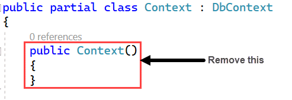

:heavy_check_mark: Also a reference is needed for
[Microsoft.VisualStudio.Web.CodeGeneration.Design](https://www.nuget.org/packages/Microsoft.VisualStudio.Web.CodeGeneration.Design/7.0.0-rc.2.22510.1)

:house: [link](#beginner-tips-for-asp.net-corerazor-pages)

# Adding a new Razor Page

In this case a page is needed for viewing notes which is done by right
clicking on the Page folder in Solution Explorer


<br>

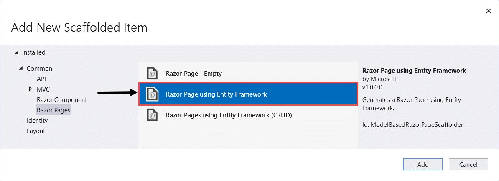

<br>

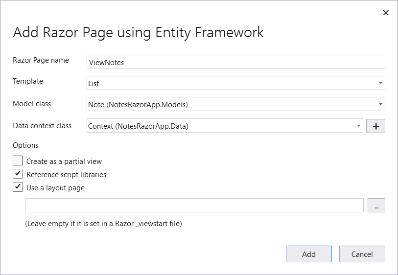

Next, under Pages, Shared, open `_Layout.cshtml`

Change

``` html
<li class="nav-item">
    <a class="nav-link text-dark" asp-area="" asp-page="/Privacy">Privacy</a>
</li>
```

To

``` html
<li class="nav-item">
    <a class="nav-link text-dark" asp-area="" asp-page="/Privacy">Privacy</a>
</li>
```

Run the project and click on `View Notes` which may take a few seconds
for EF Core to warm-up.

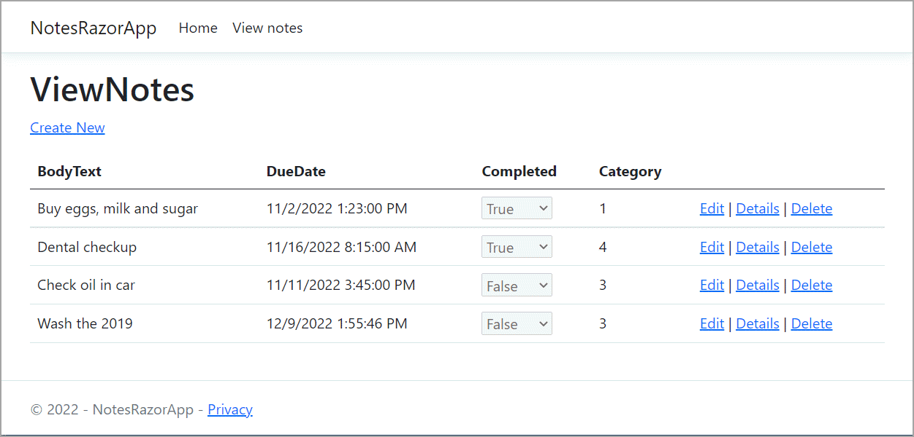

Pretty cool how easy this was to do, let's move on and make some
cosmetic changes using BootStrap so we get the following where our links
now appear as buttons and the grid has some changes to use Bootstrap and
be truly responsive although what is not done are CSS breakpoints to
keep things simple.

:house: [link](#beginner-tips-for-asp.net-corerazor-pages)

## Update site navbar

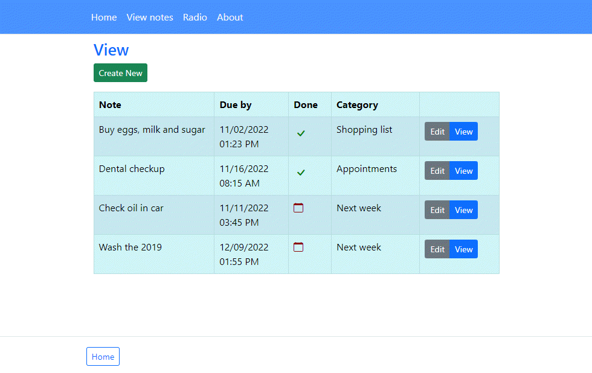

The [navbar](https://getbootstrap.com/docs/5.0/components/navbar/) has
minor changes in `_Layout.cshtml`

Change

``` html
<nav class="navbar navbar-expand-sm navbar-toggleable-sm navbar-light bg-white border-bottom box-shadow mb-3">
```

To

``` html
<nav class="navbar navbar-expand-md navbar-dark bg-primary bg-opacity-75 border-bottom">
```

:house: [link](#beginner-tips-for-asp.net-corerazor-pages)

## Update ViewNotes Page

The original page is a blank canvas, works well and could stay `as is`
but let's use Bootstrap to spice the page up.

-   Change how the bool property Completed is displayed with Bootstrap
    icons rather than a disabled drop-down
-   Format links as Bootstrap style buttons
-   Modify sizing of columns for the table to display notes.

To use Bootstap icons use
[LibMan](https://learn.microsoft.com/en-us/aspnet/core/client-side/libman/libman-vs?view=aspnetcore-6.0).
Note there are over 1,600 icons and all are not needed.

:bulb: once installed, copy the folder to another folder completely
outside on your Visual Studio solution then delete all the icons in the
project. When an icon is needed find if by travering the icons
[here](https://icons.getbootstrap.com/), find the physical file where
you copied the icons to and copy the one needed into the project.

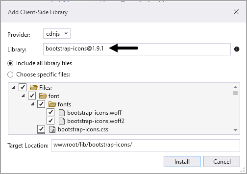

The original ViewNotes page

``` html
@page
@model NotesRazorApp.Pages.ViewNotesModel

@{
    ViewData["Title"] = "ViewNotes";
}

<h1>ViewNotes</h1>

<p>
    <a asp-page="Create">Create New</a>
</p>
<table class="table">
    <thead>
        <tr>
            <th>
                @Html.DisplayNameFor(model => model.Note[0].BodyText)
            </th>
            <th>
                @Html.DisplayNameFor(model => model.Note[0].DueDate)
            </th>
            <th>
                @Html.DisplayNameFor(model => model.Note[0].Completed)
            </th>
            <th>
                @Html.DisplayNameFor(model => model.Note[0].Category)
            </th>
            <th></th>
        </tr>
    </thead>
    <tbody>
@foreach (var item in Model.Note) {
        <tr>
            <td>
                @Html.DisplayFor(modelItem => item.BodyText)
            </td>
            <td>
                @Html.DisplayFor(modelItem => item.DueDate)
            </td>
            <td>
                @Html.DisplayFor(modelItem => item.Completed)
            </td>
            <td>
                @Html.DisplayFor(modelItem => item.Category.CategoryId)
            </td>
            <td>
                <a asp-page="./Edit" asp-route-id="@item.NoteId">Edit</a> |
                <a asp-page="./Details" asp-route-id="@item.NoteId">Details</a> |
                <a asp-page="./Delete" asp-route-id="@item.NoteId">Delete</a>
            </td>
        </tr>
}
    </tbody>
</table>
```

**Updated**

``` html
@page
@model NotesRazorApp.Pages.ViewNotesModel

@{
    ViewData["Title"] = "View notes";
}

<div class="container">

    <h3 class="text-primary mt-2">View</h3>

    <p>
        <a asp-page="NewNote" class="btn btn-success btn-sm">Create New</a>
    </p>

    <table class="table table-responsive table-info table-bordered table-striped table-responsive-sm mw-100" style="width: 1000px">
        <thead>
            <tr>
                <th width="160">
                    @Html.DisplayNameFor(model => model.Note[0].BodyText)
                </th>
                <th width="10">
                    @Html.DisplayNameFor(model => model.Note[0].DueDate)
                </th>
                <th width="5">
                    @Html.DisplayNameFor(model => model.Note[0].Completed)
                </th>
                <th width="10">
                    @Html.DisplayNameFor(model => model.Note[0].Category)
                </th>
                <th th width="10"></th>
            </tr>
        </thead>
        <tbody>
            @foreach (var item in Model.Note)
            {
                <tr>
                    <td>
                        @Html.DisplayFor(modelItem => item.BodyText)
                    </td>
                    <td>
                        @item.DueDate?.ToString("MM/dd/yyyy hh:mm tt")
                    </td>
                    <td>
                        @{
                            if (@item.Completed)
                            {
                                <i class="bi-check" style="font-size: 1.5rem; color: green;"></i>
                            }
                            else
                            {
                                <i class="bi-calendar" style="font-size: 1rem; color:darkred"></i>
                            }
                        }
                    </td>
                    <td>
                        @{
                            @item.Category.CategoryName;
                        }
                    </td>

                    <td>
                        <div class="btn-group" role="group" aria-label="Basic example">
                            <a asp-page="./EditNote" asp-route-id="@item.NoteId" class="btn btn-secondary btn-sm">Edit</a>
                            <a asp-page="./DetailNote" asp-route-id="@item.NoteId" class="btn btn-primary btn-sm">View</a>
                        </div>

                    </td>

                </tr>
            }
        </tbody>
    </table>
</div>
```

To get column names different than the properties in the model we use
data annotations e.g.


To size the table the `width` is set to `1000px`, Bootstrap along with
Bootstrap [mw-100](https://getbootstrap.com/docs/5.0/utilities/sizing/)
sizing class.

``` html
<table class="table table-responsive table-info table-bordered table-striped table-responsive-sm mw-100" style="width: 1000px">
```

In the table header, the width are hard-coded but since using Bootstrap
we remain responsive.

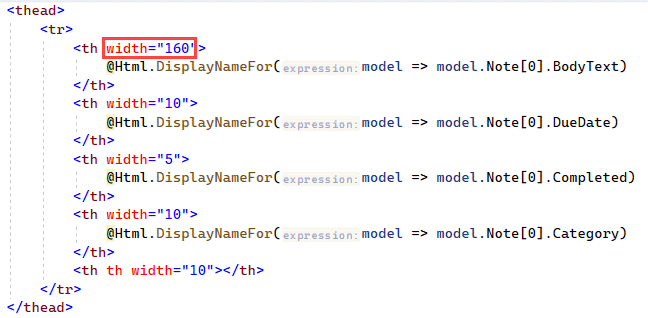

Icons are used for the Completed property.

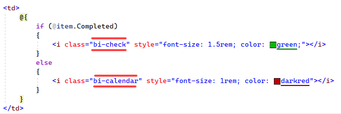

:bulb: Add Bootstrap icons include into \_Layout.cshtml


:house: [link](#beginner-tips-for-asp.net-corerazor-pages)

### EF Core intitial load

The first time EF Core is called to load data take time to warm-up, for
this there is some CSS integrated into the link to open the ViewNotes
page.

``` css
.spinnerButton {
    position: relative;
    padding: 8px 16px;
    border: none;
    outline: none;
    border-radius: 2px;
    cursor: pointer;
}

.spinnerButton__text {
    transition: all 0.2s;
}

.spinnerButton--loading .spinnerButton__text {
    visibility: hidden;
    opacity: 0;
}

.spinnerButton--loading::after {
    content: "";
    position: absolute;
    width: 16px;
    height: 16px;
    top: 0;
    left: 0;
    right: 0;
    bottom: 0;
    margin: auto;
    border: 4px solid transparent;
    border-top-color: greenyellow;
    border-radius: 50%;
    animation: spinnerButton-loading-spinner 1s ease infinite;
}

@keyframes spinnerButton-loading-spinner {
    from {
        transform: rotate(0turn);
    }

    to {
        transform: rotate(1turn);
    }
}
```

Usage

``` html
<li class="nav-item">
    <a class="nav-link text-light spinnerButton" asp-area="" asp-page="/ViewNotes" id="spinMe"
        onclick="document.getElementById('spinMe').classList.remove('text-light');document.getElementById('spinMe').classList.add('text-primary');this.classList.toggle('spinnerButton--loading')">View notes</a>
</li>
```

`onclick` remove the current style for the link, add a new style to hide
the link text followed by using the above styles to create a simple
spinner which disappears once the ViewNotes pages is rendered.

:house: [link](#beginner-tips-for-asp.net-corerazor-pages)

# Add the Detail Page

This page is to display one note using convention method to create a
page with the following parameters.

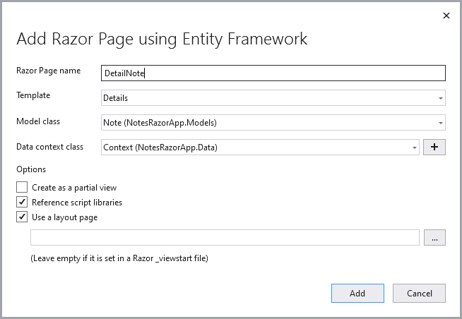

Once the page has been created open ViewNotes page and change the last
row, colum for links to

``` html
<td>
    <a asp-page="./Edit" asp-route-id="@item.NoteId">Edit</a> |
    <a asp-page="./DetailNote" asp-route-id="@item.NoteId">Details</a> |
</td>
```

:heavy_check_mark: the remove option has been removed as for this
application we are keeping all notes. For a real application we would
move notes to archive.

Run the project, view the notes and click on details for one note. First
thing to notice is the the property Completed is showing as a disabled
dropdown, let fix this next.

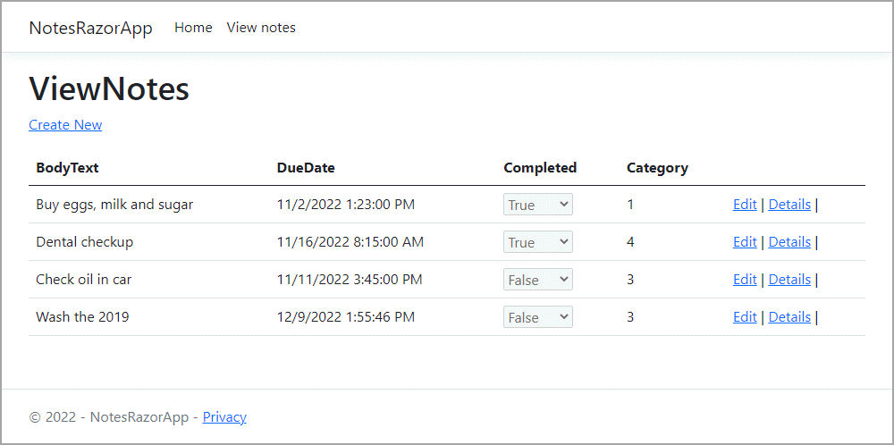

Current markup for DetailNote page.

``` html
@page
@model NotesRazorApp.Pages.DetailNoteModel

@{
    ViewData["Title"] = "DetailNote";
}

<h1>DetailNote</h1>

<div>
    <h4>Note</h4>
    <hr />
    <dl class="row">
        <dt class="col-sm-2">
            @Html.DisplayNameFor(model => model.Note.BodyText)
        </dt>
        <dd class="col-sm-10">
            @Html.DisplayFor(model => model.Note.BodyText)
        </dd>
        <dt class="col-sm-2">
            @Html.DisplayNameFor(model => model.Note.DueDate)
        </dt>
        <dd class="col-sm-10">
            @Html.DisplayFor(model => model.Note.DueDate)
        </dd>
        <dt class="col-sm-2">
            @Html.DisplayNameFor(model => model.Note.Completed)
        </dt>
        <dd class="col-sm-10">
            @Html.DisplayFor(model => model.Note.Completed)
        </dd>
        <dt class="col-sm-2">
            @Html.DisplayNameFor(model => model.Note.Category)
        </dt>
        <dd class="col-sm-10">
            @Html.DisplayFor(model => model.Note.Category.CategoryId)
        </dd>
    </dl>
</div>
<div>
    <a asp-page="./Edit" asp-route-id="@Model.Note?.NoteId">Edit</a> |
    <a asp-page="./Index">Back to List</a>
</div>
```

Next some radical changes in regards to styling along with using
Bootstrap icons to replace the dropdown for the property Completed.

The style `editGroupList` is for setting a custom width for displaying
property names which is located in `site.css`

``` css
.editGroupList {
    width: 115px !important;
}
```

``` html
@page
@model NotesRazorApp.Pages.DetailNoteModel

@{
    ViewData["Title"] = "DetailNote";
}

<h3 class="text-primary mt-2">Details</h3>

<div class="mb-2">

    <ul class="list-group list-group-horizontal">
        <li class="list-group-item text-end fw-bold editGroupList border-0">@Html.DisplayNameFor(model => model.Note.NoteId)</li>
        <li class="list-group-item border-0 fw-bold">@Html.DisplayFor(model => model.Note.NoteId)</li>
    </ul>

    <ul class="list-group list-group-horizontal">
        <li class="list-group-item text-end fw-bold editGroupList border-0">@Html.DisplayNameFor(model => model.Note.BodyText)</li>
        <li class="list-group-item border-0">@Html.DisplayFor(model => model.Note.BodyText)</li>
    </ul>

    <ul class="list-group list-group-horizontal">
        <li class="list-group-item text-end fw-bold editGroupList border-0">@Html.DisplayNameFor(model => model.Note.DueDate)</li>
        <li class="list-group-item border-0">@Model.Note.DueDate?.ToShortDateString()</li>
    </ul>

    <ul class="list-group list-group-horizontal">
        <li class="list-group-item text-end fw-bold editGroupList border-0">
            @Html.DisplayNameFor(model => model.Note.Completed)
        </li>
        <li class="list-group-item border-0">
            @{
                if (@Model.Note.Completed)
                {
                    <i class="bi-check" style="font-size: 1.5rem; color: green;"></i>
                }
                else
                {
                    <i class="bi-calendar" style="font-size: 1rem; color: darkred"></i>
                }
            }
        </li>

    </ul>

    <ul class="list-group list-group-horizontal">
        <li class="list-group-item text-end fw-bold border-0 editGroupList">@Html.DisplayNameFor(model => model.Note.Category)</li>
        <li class="list-group-item border-0">@{@Model.Note.Category.CategoryName;}</li>
    </ul>

</div>


<div class="btn-group-sm" role="group">
    <a asp-page="./EditNote" class="btn btn-primary custombtnGroup" asp-route-id="@Model.Note?.NoteId">Edit</a>
    <a asp-page="ViewNotes" class="btn btn-primary custombtnGroup">Back to List</a>
</div>
```

In code behind for the original scaffolding only the `Note` model is
included, to get the `CategoryName` we need to include the `Catgory`
table, otherwise we only have the `CategoryId`

``` csharp
var note = await _context.Note.Include(n => n.Category)
    .FirstOrDefaultAsync(n => n.NoteId == id);
```

Now using the view note details this is the view.

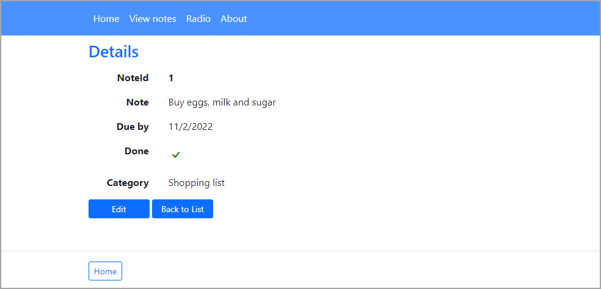

:house: [link](#beginner-tips-for-asp.net-corerazor-pages)

# Add the Edit note Page

When scaffolding a page to edit a note, the scaffolding process displays
category information in a dropdown without a dropdown indicator for
category identifier and for done property an input showing True or
False.

To remedy the Category from showing the identifier to display the
category name, open `EditNote.cshtml.cs` and change in `OnGetAsync` the
folowing

``` csharp
var note =  await _context.Note.FirstOrDefaultAsync(m => m.NoteId == id);
```

To include Category model.

``` csharp
var note =  await _context.Note.Include(x => x.Category)
    .FirstOrDefaultAsync(m => m.NoteId == id);
```

Add the following method to `EditNote.cshtml.cs` which provides the list
of categories to the dropdown for categories and selects the category
for the current note.

``` csharp
private void SetupCategories()
{
    ViewData["CategoryName"] = new SelectList(
        _context.Category.ToList(),
        nameof(Note.CategoryId),
        nameof(Note.Category.CategoryName));
}
```

Back in `OnGetAsync` replace

``` csharp
ViewData["CategoryId"] = new SelectList(
    _context.Category, "CategoryId", "CategoryId");
```

With

``` csharp
SetupCategories();
```

Next, if the model is not valid when the page is loaded again the
category list is lost so one more modification is needed.

Change from

``` csharp
public async Task<IActionResult> OnPostAsync()
{
    if (!ModelState.IsValid)
    {
        return Page();
    }
```

To the following which ensure the category list is loaded as in the
intial page load.

``` csharp
public async Task<IActionResult> OnPostAsync()
{

    if (!ModelState.IsValid)
    {
        SetupCategories();
        return Page();
    }
```

To handle code to display properly in `EditNote.cshtml`, change

``` html
<div class="form-group">
    <label asp-for="Note.CategoryId" class="control-label"></label>
    <select asp-for="Note.CategoryId" class="form-control" asp-items="ViewBag.CategoryId"></select>
    <span asp-validation-for="Note.CategoryId" class="text-danger"></span>
</div>
```

To

``` html
<div>
    <label asp-for="Note.CategoryId" class="mt-2 text-primary">Category</label>
    <select asp-for="Note.Category.CategoryId" class="form-select mb-2" asp-items="ViewBag.CategoryName"></select>
    <span asp-validation-for="Note.CategoryId" class="text-danger"></span>
</div>
```

The original input used the class `form-control` for the dropdown which
works but does not display a dropdown 🠋, to fix this change
`form-control` to `form-select`.

For the Completed property, change from

``` html
<div class="form-group">
    <label asp-for="Note.Completed" class="control-label"></label>
    <input asp-for="Note.Completed" class="form-control" />
    <span asp-validation-for="Note.Completed" class="text-danger"></span>
</div>
```

To which uses `form-check form-switch` for the top level `div` to
indicate rendering a checkbox in tangent with
`type="checkbox" class="form-check-input"` for the input.

``` html
<div class="form-check form-switch">
    <input asp-for="Note.Completed" type="checkbox" class="form-check-input"/>
    <label asp-for="Note.Completed" class="text-primary"></label>
</div>
```

:bulb: Each div which has the class `form-group` are not needed along
with the use of `control-label` which were needed in prior versions of
Bootstrap.

**Side note** Review code in `RadioButtonsPage` to see how to properly
use radio-buttons styled with Bootstrap. Many code samples on the web
will use the same identifier for a input to group radio buttons, note
`id="Gender@(gender)"` generates identifiers which provide grouping
along with using `value="@gender"` for each input styled with
`form-check-input` and the labe matches the identifier for the radio
button input using `for="Gender@(gender)"`.

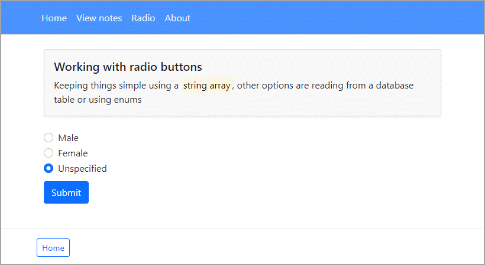

The source for these radio-buttons is a string array, other
possibilities are enum. With EF Core use
[HasConversion](https://learn.microsoft.com/en-us/ef/core/modeling/value-conversions?tabs=data-annotations).

Example where the main table is for wine and the secondar table for wine
types.

``` csharp
public class Wine
{
    public int WineId { get; set; }
    public string Name { get; set; }
    public WineVariantId WineVariantId { get; set; }
    public WineVariant WineVariant { get; set; }
    public override string ToString() => Name;
}
```

<br>

``` csharp
public enum WineVariantId : int
{
    Red = 0,
    White = 1,
    Rose = 2
}
```

<br>

``` csharp
public class WineVariant
{
    public WineVariantId WineVariantId { get; set; }
    public string Name { get; set; }
    public List<Wine> Wines { get; set; }
    public override string ToString() => Name;
}
```

<br>

``` csharp
protected override void OnModelCreating(ModelBuilder modelBuilder)
{
    modelBuilder
        .Entity<Wine>()
        .Property(e => e.WineVariantId)
        .HasConversion<int>();

    modelBuilder
        .Entity<WineVariant>()
        .Property(e => e.WineVariantId)
        .HasConversion<int>();

    modelBuilder
        .Entity<WineVariant>().HasData(
            Enum.GetValues(typeof(WineVariantId))
                .Cast<WineVariantId>()
                .Select(e => new WineVariant()
                {
                    WineVariantId = e,
                    Name = e.ToString()
                })
        );
}
```

:heavy_check_mark: See [EF Core Value
Conversions](https://github.com/karenpayneoregon/ef-core-transforming)
for how to use the above.

:house: [link](#beginner-tips-for-asp.net-corerazor-pages)

# Add the create note page

As with the edit page, category is shown as the identifier rather than
text.

Change the following

``` csharp
public NewNoteModel(NotesRazorApp.Data.Context context)
{
    _context = context;
}
```

To

``` csharp
public NewNoteModel(Context context)
{
    _context = context;
    // for setting default due by
    Note = new Note();
}
```

> **Note** The code for posting a new record by default will not work

In `OnPostAsync` the following `_context.Note.Add(Note)` will cause a
runtime exception refering to identity.

``` csharp
public async Task<IActionResult> OnPostAsync()
{
    if (!ModelState.IsValid)
    {
        return Page();
    }

    _context.Note.Add(Note);
    await _context.SaveChangesAsync();

    return RedirectToPage("./Index");
}
```

Change the above to
[Attach](https://learn.microsoft.com/en-us/dotnet/api/microsoft.entityframeworkcore.dbcontext.attach?view=efcore-6.0)
rather than
[Add](https://learn.microsoft.com/en-us/dotnet/api/microsoft.entityframeworkcore.dbcontext.add?view=efcore-6.0)

``` csharp
public async Task<IActionResult> OnPostAsync()
{

    if (!ModelState.IsValid)
    {
        return Page();
    }

    _context.Note.Attach(Note);

    await _context.SaveChangesAsync();

    return RedirectToPage("ViewNotes");
}
```

Then in `OnGet` from code to display the category identifier in a
dropdown

``` csharp
public IActionResult OnGet()
{
    ViewData["CategoryId"] = new SelectList(
        _context.Category, "CategoryId", "CategoryId");
    return Page();
}
```

To the following for displaying category names, same idea as in the edit
page.

``` csharp
public IActionResult OnGet()
{
            
    Note.DueDate = DateTime.Now;
            
    ViewData["CategoryName"] = new SelectList(
        _context.Category.ToList(),
        nameof(Note.CategoryId),
        nameof(Note.Category.CategoryName));

    return Page();

}
```

In `NewNote.cshtml` change from

``` html
<div class="form-group">
    <label asp-for="Note.CategoryId" class="control-label"></label>
    <select asp-for="Note.CategoryId" class ="form-control" asp-items="ViewBag.CategoryId"></select>
</div>
```

To this to display the category names.

``` html
<div>
    <label asp-for="Note.CategoryId">Category</label>
    <select asp-for="Note.Category.CategoryId" class="form-select mb-2" asp-items="ViewBag.CategoryName" onchange="GetInfo(this)"></select>
</div>
```

Then change

``` html
<div class="form-group">
    <label asp-for="Note.Completed" class="control-label"></label>
    <input asp-for="Note.Completed" class="form-control" />
    <span asp-validation-for="Note.Completed" class="text-danger"></span>
</div>
```

To the following for properly displaying a check input

``` html
<div class="form-check form-switch">
    <label class="form-check-label">
        <input class="form-check-input mb-3" asp-for="Note.Completed" /> @Html.DisplayNameFor(model => model.Note.Completed)
    </label>
</div>
```

:house: [link](#beginner-tips-for-asp.net-corerazor-pages)

# Formatting dates

The top image show default format for a date time which includes seconds
and milliseconds which are not needed to be seen.

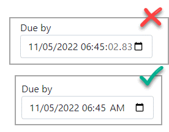

In this case add `asp-format="{0:yyyy-MM-ddTHH:mm}"` to the input

``` html
<input asp-for="Note.DueDate" class="form-control mb-2" asp-format="{0:yyyy-MM-ddTHH:mm}" />
```

Then in the model

``` html
[DisplayFormat(ApplyFormatInEditMode = false, DataFormatString = "{0:dd/MM/yyyy HH:mm tt}")]
public DateTime? DueDate { get; set; }
```

<br>

:small_orange_diamond: See [Working with Dates And Times in Razor Pages
Forms](https://www.mikesdotnetting.com/article/352/working-with-dates-and-times-in-razor-pages-forms)
by Mike Brind for more indepth information on dates/times.

# Summary

Various tips have been presented to assist with some finer points for getting a handle on working with Razor Pages and Entity Framework Core that are not generally discussed in post articles. If just starting out with Razor Pages start off with Microsoft docs [Introduction to Razor Pages in ASP.NET Core](https://learn.microsoft.com/en-us/aspnet/core/razor-pages/?view=aspnetcore-6.0&tabs=visual-studio), [Learn Razor Pages](https://www.learnrazorpages.com/) along with if not familar with EF Core check out Microsof docs on [Entity Framework Core](https://learn.microsoft.com/en-us/ef/core/) and [Various tips for working with Entity Framework Core 6](https://github.com/karenpayneoregon/ef-core-6-tips).

:house: [link](#beginner-tips-for-asp.net-corerazor-pages)